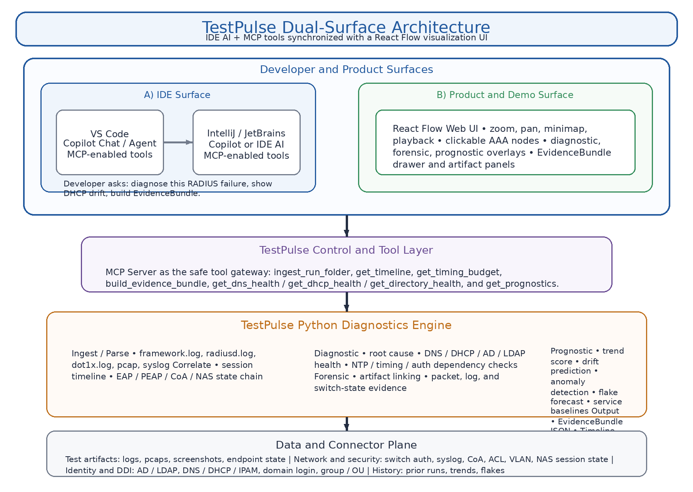
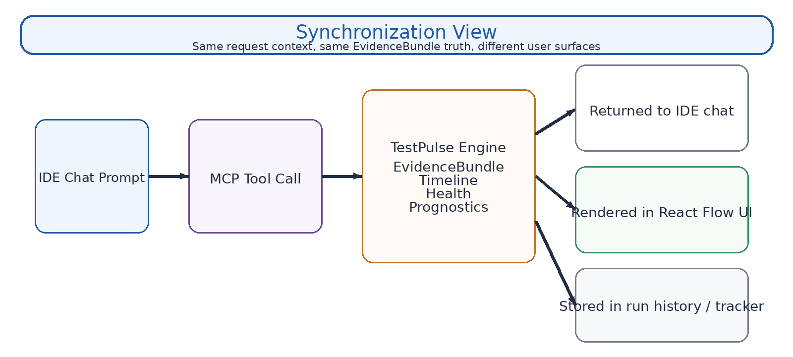

# TestPulse Dual-Surface Architecture

## Design correction

The clean visual story is **not**:

`VS Code / IntelliJ -> React Flow -> MCP -> Copilot`

It should be **two front ends over one TestPulse intelligence layer**:

- **Developer front end:** VS Code / IntelliJ with AI chat or agent tools
- **Product front end:** React Flow visualization UI
- **Shared middle:** TestPulse MCP plus the Python diagnostics engine
- **Shared data plane:** logs, pcaps, switch state, AD/LDAP, DNS/DHCP, and EvidenceBundle history

## Architecture summary

TestPulse is a **dual-surface platform**. Developers interact through IDE AI chat plus MCP tools, while operators and customers use a React Flow visualization UI. Both experiences are synchronized through the same TestPulse diagnostics engine and the same EvidenceBundle truth model.

## Executive view

## Synchronization view

## Commercialization story

TestPulse gives engineering **two synchronized experiences over the same truth**:

1. **Inside the IDE**
   - developers use Copilot or IDE AI to ask questions and run diagnostics
   - MCP keeps the interaction on a safe tool rail
   - engineers avoid raw log digging and manual correlation

2. **Inside the product UI**
   - operations, QA, support, and customers see an interactive AAA map
   - the view is zoomable, clickable, and evidence-backed
   - diagnostics, forensics, and prognostics live in one pane

3. **Inside the platform core**
   - the same backend produces timelines, health signals, and EvidenceBundles
   - there is no duplicate logic and no separate demo engine
   - the same output powers the IDE, dashboards, and future reports

## Recommended component mapping

### IDE layer
- **VS Code** with GitHub Copilot Chat and MCP tools first
- **JetBrains / IntelliJ** added next with Copilot or JetBrains AI Assistant

### Visualization layer
- **React Flow** as the runtime visualization surface
- use it for zoom, pan, minimap, overlays, and clickable AAA nodes

### Tool layer
- **MCP** as the safe gateway for timeline retrieval, DNS/DHCP/AD/LDAP diagnostics, EvidenceBundle generation, and prognostic scoring

## React Flow screen priorities

Render these nodes in the main flow:
- Endpoint / Supplicant
- DHCP
- DNS
- AD / LDAP
- PEAP / EAP
- RADIUS
- NAS Authorization
- CoA / Reauth
- EvidenceBundle

Add these overlays:
- **Diagnostic:** current failure cause
- **Forensic:** linked artifacts, logs, pcap, switch state
- **Prognostic:** trend score, drift warning, anomaly, flake risk, baseline deviation

## Phase roadmap

### Phase 1
- VS Code + GitHub Copilot + MCP
- React Flow web UI
- Python TestPulse backend
- single MCP server

### Phase 2
- add JetBrains / IntelliJ
- optionally support JetBrains AI Assistant as a second chat front end
- keep the same MCP-backed TestPulse services

### Phase 3
- expose a customer-facing dashboard
- add reporting, export, and tracker sync
- make prognostics a visible early-warning panel

## One-line architecture summary

> **TestPulse is a dual-surface platform:** developers interact through **IDE AI chat + MCP tools**, while operators and customers use a **React Flow visualization UI**. Both are synchronized through the same **TestPulse diagnostics engine**, which produces shared timelines, health signals, and EvidenceBundles.
